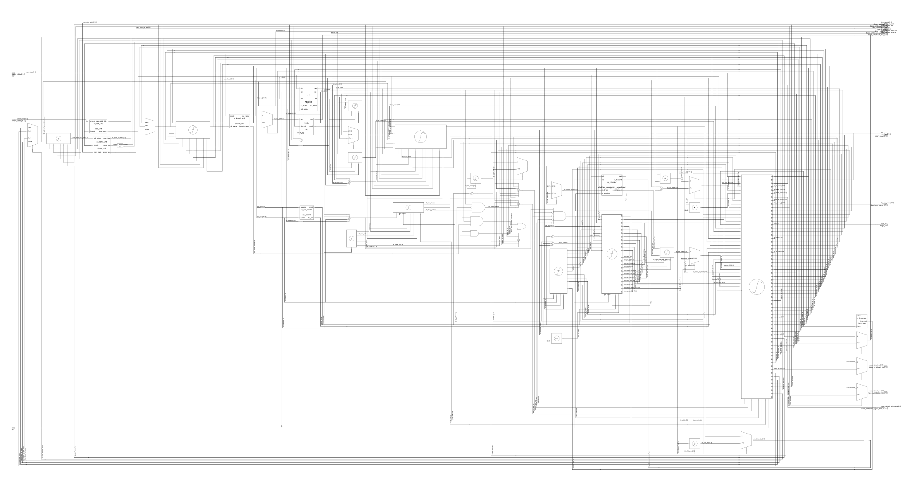
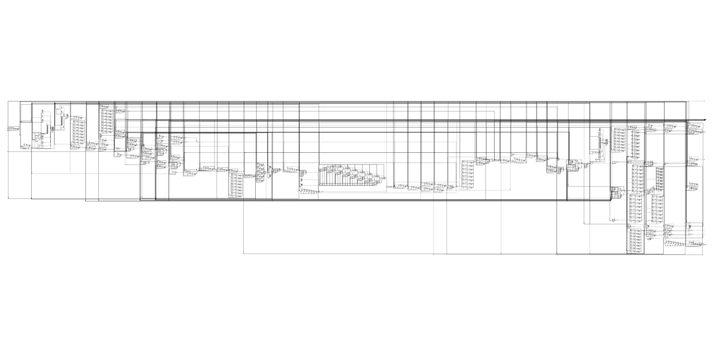

# RV32IM 5-Stage Pipelined CPU with AXI4-Lite I-Cache and D-Cache

This repository contains a final bare-metal RV32IM CPU project implemented in Verilog/SystemVerilog and set up for Synopsys VCS and Verdi.

The final design is a five-stage in-order RV32IM pipeline with a split AXI4-Lite cache hierarchy:

```text
CPU IF stage  -> AXI-Lite direct-mapped I-cache -> AXI-Lite instruction memory
CPU MEM stage -> AXI-Lite direct-mapped write-back D-cache -> AXI-Lite data memory
```



Earlier non-cache and simple-cache testbenches are kept in the repo as regression checkpoints, but the final memory-system checkpoint is the AXI-Lite I-cache + D-cache version.

The design intentionally favors readable RTL and observable behavior over peak
performance, making the pipeline, cache-miss interlocks, and AXI4-Lite
handshakes straightforward to study in simulation.

## Architecture summary

Pipeline stages:

```text
IF  -> instruction fetch
ID  -> decode and register read
EX  -> ALU, branch/jump resolution, and divide/remainder issue
MEM -> data memory / D-cache access and load/store formatting
WB  -> register writeback and architectural retirement
```

The detailed datapath below shows the pipeline registers, forwarding paths,
control flow, and cache-facing interfaces.



Implemented CPU features:

```text
RV32I base integer ISA
RV32M multiply/divide extension
5-stage IF/ID/EX/MEM/WB pipeline
EX/MEM -> EX forwarding
MEM/WB -> EX forwarding
WB -> ID bypass
load-use hazard stall
store-data forwarding
branch/JAL/JALR flush
WB-stage ECALL/EBREAK halt
8-stage pipelined divider for DIV/DIVU/REM/REMU
trace/debug writeback outputs
dmem_valid/dmem_ready memory-stall interface
imem_valid/imem_ready instruction-fetch stall interface
```

## Cache and memory system

Final cache hierarchy:

```text
rtl/axil_direct_mapped_icache.v     AXI-Lite-backed direct-mapped read-only I-cache
rtl/axil_direct_mapped_dcache.v     AXI-Lite-backed direct-mapped write-back D-cache
rtl/axil_imemory.v                  AXI-Lite instruction backing-memory model
rtl/axil_memory.v                   AXI-Lite data backing-memory model
```

The I-cache implements:

```text
direct-mapped instruction cache
one 32-bit word per line
blocking miss handling
AXI-Lite AR/R refill path
access/hit/miss counters
```

The D-cache implements:

```text
direct-mapped data cache
one 32-bit word per line
byte write enables
write-back policy
write-allocate on store miss
dirty victim writeback over AXI-Lite
refill over AXI-Lite read channel
blocking miss handling
AXI-Lite AR/R/AW/W/B channel handshakes
access/hit/miss/writeback counters
```

A simple internal-memory D-cache is also kept as an educational intermediate checkpoint:

```text
rtl/direct_mapped_dcache.v
```

## Repository layout

```text
.
|-- rtl/                         CPU, cache, and AXI4-Lite memory RTL
|-- tb/                          Self-checking testbenches and simple memories
|-- programs/                    Test and benchmark images/listings
|   `-- riscv_isa/               Preconverted RV32I/RV32M ISA tests
|-- scripts/                     ISA regression driver
|-- docs/                        Architecture, verification, and debug notes
|-- filelist_pipeline_*.f        VCS source lists
`-- Makefile                     Icarus Verilog and VCS targets
```

The final integrated configuration is exercised by
`tb/tb_pipeline_axil_icache.v` and
`tb/tb_pipeline_axil_icache_dhrystone.v`.

## Requirements

Use a Unix-like shell (Linux, macOS, or WSL) with GNU Make and one of:

- [Icarus Verilog](https://steveicarus.github.io/iverilog/) for the open-source
  `sim-*` targets
- Synopsys VCS for the complete ISA regression and Verdi debug flow

The multi-program ISA regression also requires Bash. A RISC-V cross-compiler is
not required to run the checked-in tests because their memory images are
included under `programs/`.

## Quick start with Icarus Verilog

The `sim-*` targets compile and immediately run one testbench. A useful
progression is:

```bash
make sim-directed
make sim-extended
make sim-hazard
make sim-axil-icache
make sim-axil-icache-dhrystone

# Run the shorter set used by GitHub Actions
make sim-ci
```

The final two targets exercise the split AXI4-Lite I-cache/D-cache system.
Generated files are written below `build/`.

## Quick start with Synopsys VCS

Run the core pipeline regressions:

```bash
make clean
make run-vcs-directed
make run-vcs-extended
make run-vcs-hazard
make run-vcs-riscv-isa
make run-vcs-dhrystone
```

Run the simple internal-memory D-cache regressions:

```bash
make run-vcs-cache
make run-vcs-cache-dhrystone
```

Run the AXI-Lite D-cache regressions:

```bash
make run-vcs-axil-cache
make run-vcs-axil-cache-dhrystone
```

Run the final AXI-Lite I-cache + D-cache regressions:

```bash
make run-vcs-axil-icache
make run-vcs-axil-icache-dhrystone
```

Run everything:

```bash
make run-vcs-all
```

## Recorded verification status

The repository documents the following results from its Synopsys VCS
verification checkpoint. They were not regenerated as part of this README update:

```text
Directed architectural test: PASS
Extended RV32IM test: PASS
Pipeline hazard/divider regression: PASS
RISC-V ISA regression: PASS=46 FAIL=0
Dhrystone benchmark without cache: PASS, x5 = 0x003fffff
AXI-Lite D-cache conflict/write-back test: PASS
AXI-Lite I-cache + D-cache conflict/write-back test: PASS
Dhrystone with AXI-Lite D-cache: PASS, x5 = 0x003fffff
Dhrystone with AXI-Lite I-cache + D-cache: PASS, x5 = 0x003fffff
```

The final cached Dhrystone reference used 64 one-word lines (256 bytes)
in each cache and separate 65,536-word instruction/data memory models with
three-cycle configured backing-memory latency:

```text
AXI-Lite I-cache + D-cache Dhrystone: PASS after 1,365,924 cycles
I-cache accesses = 368,993, hits = 226,574, misses = 142,419
D-cache accesses = 79,394, hits = 68,740, misses = 10,654, writebacks = 6,056
```

## Important files

```text
rtl/rv32im_pipeline.v                  top-level five-stage pipelined CPU
rtl/divider_unsigned_pipelined.v       8-stage unsigned divider core
rtl/regfile.v                          integer register file
rtl/alu.v                              ALU for non-divide operations
rtl/load_unit.v                        load sign/zero extension
rtl/store_unit.v                       store byte-enable generation
rtl/axil_direct_mapped_icache.v        AXI-Lite-backed I-cache
rtl/axil_direct_mapped_dcache.v        AXI-Lite-backed D-cache
rtl/axil_imemory.v                     AXI-Lite instruction memory model
rtl/axil_memory.v                      AXI-Lite data memory model

tb/tb_pipeline_directed.v                  directed architectural regression
tb/tb_pipeline_extended.v                  RV32IM extended regression
tb/tb_pipeline_hazard.v                    hazard/divider regression
tb/tb_pipeline_riscv_isa.v                 RV32I/RV32M ISA regression
tb/tb_pipeline_dhrystone.v                 Dhrystone without cache
tb/tb_pipeline_axil_cache.v                AXI-Lite D-cache regression
tb/tb_pipeline_axil_cache_dhrystone.v      Dhrystone with AXI-Lite D-cache
tb/tb_pipeline_axil_icache.v               AXI-Lite I-cache + D-cache regression
tb/tb_pipeline_axil_icache_dhrystone.v     Dhrystone with AXI-Lite I-cache + D-cache

programs/cache_test.hex                cache conflict/write-back program
programs/cache_test.lst                readable listing for the cache program
programs/pipeline_hazard.hex           hazard/divider regression program
programs/riscv_isa/                    preconverted RV32I/RV32M ISA tests
```

## Documentation

- [Pipeline architecture](docs/PIPELINE_ARCHITECTURE.md)
- [Final AXI4-Lite I-cache + D-cache architecture](docs/AXIL_ICACHE_DCACHE_ARCHITECTURE.md)
- [AXI4-Lite D-cache checkpoint](docs/AXIL_DCACHE_ARCHITECTURE.md)
- [Internal-memory D-cache checkpoint](docs/DCACHE_ARCHITECTURE.md)
- [Test plan](docs/TEST_PLAN.md)
- [Final verification status](docs/PIPELINE_FINAL_STATUS.md)
- [Hazard regression](docs/HAZARD_REGRESSION.md)
- [Cache-stall forwarding fix](docs/CACHE_STALL_FIX.md)
- [VCS/Verdi flow](docs/VERDI_FLOW.md)
- [Program fixtures and provenance](programs/README.md)

## Notes

This is a bare-metal educational RTL CPU. It does not implement privilege modes, CSRs, interrupts, precise exceptions, compressed instructions, atomics, floating point, virtual memory, or Linux support.

The caches are blocking and one-word-per-line. The design goal is clarity: the pipeline must stall correctly while instruction and data caches perform AXI-Lite refill and dirty writeback transactions.

The AXI4-Lite interfaces are simulation-oriented: the bundled memories and
caches model the five handshake channels used by this project, but do not
implement every optional signal or error-handling behavior of a production
interconnect.

Aligned halfword and word accesses are required; misaligned accesses are not
completed correctly and do not raise a precise trap. There is no cache-flush or
instruction-cache invalidation interface.

`FENCE` and `FENCE.I` are treated as no-ops. `ECALL` and `EBREAK` stop the
core through its `halt` output, and unsupported encodings assert
`illegal_insn`.

The final CPU/cache/memory system is composed in the final testbenches rather
than in a separate synthesizable SoC wrapper.